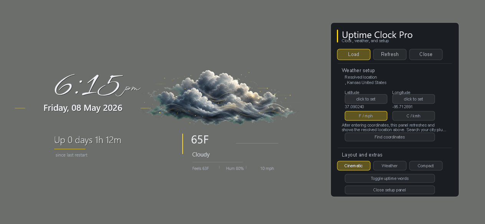
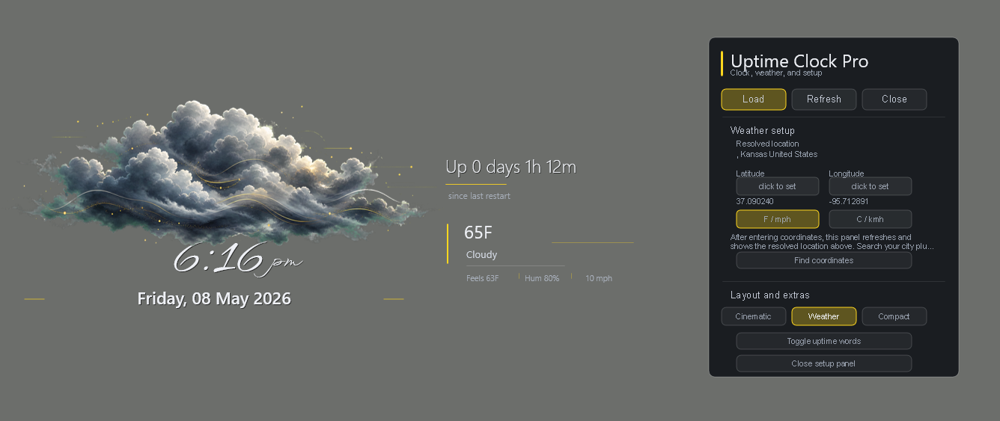
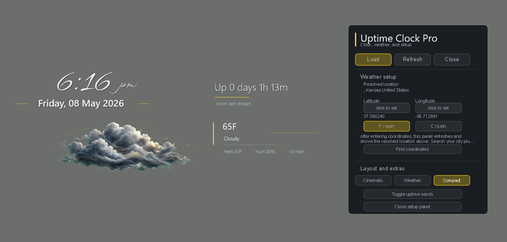
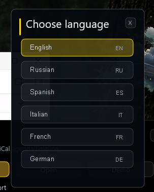

# Uptime Clock Pro

Uptime Clock Pro is a custom Rainmeter clock/weather skin. The project has been refocused around one strong desktop anchor: expressive time, date, and simplified weather with custom condition visuals.

This is a stable beta Rainmeter release. The core clock/weather experience is ready for beta distribution, with future settings and polish passes still planned.

## Preview

### Cinematic



### Weather



### Compact



### Language Picker



## Download

Get the current stable beta from the GitHub Releases page:

[Uptime Clock Pro 0.6.1 Stable Beta](https://github.com/PetersMinistry/rainmeter-uptime-clock-pro/releases/tag/v0.6.1-beta.1)

## Skin Layout

The Rainmeter skin lives in:

```text
Skins\UptimeClockPro
```

Load the control panel from:

```text
UptimeClockPro\Control\Launcher.ini
```

Load the main clock/weather anchor directly from:

```text
UptimeClockPro\Clock\Anchor.ini
```

Load the optional uptime words module from:

```text
UptimeClockPro\Uptime\Words.ini
```

## Current Features

- Large expressive time and date anchor.
- Integrated current weather using Open-Meteo with no API key.
- Custom painterly PNG weather scenes driven by Open-Meteo weather codes.
- Weather scene coverage for clear day/night, partly cloudy day/night, cloudy day/night, drizzle, rain, showers, heavy rain, storm, hail, snow, fog, ice/freezing, and windy basic-sky conditions.
- Temperature, condition text, and compact weather details worked into the clock composition.
- Integrated control/settings block for loading, refreshing, closing, adjusting weather coordinates/units, and showing the resolved location for saved coordinates.
- Optional 12-hour or 24-hour clock display from the setup panel.
- Three menu-selectable clock layout presets: Cinematic, Weather, and Compact.
- English, Russian, Spanish, Italian, French, and German language selection for the clock weather labels, settings panel, language picker, and optional uptime words module.
- Optional text-only uptime words module that can be loaded and placed independently.

## Notes

- Weather uses latitude/longitude variables stored in `Skins\UptimeClockPro\@Resources\UserSettings.inc`.
- Weather coordinates and Fahrenheit/Celsius units can be adjusted from `Control\Launcher.ini`. The settings block shows the current saved coordinates and reverse-looked-up location so a user can tell whether the input was accepted; city, postal, and ZIP lookup still belong in a future settings pass.
- The current weather art is raster-based, not shape-only, and is included with the skin resources.
- Layout presets are stored in `@Resources\Layouts` and selected through `LayoutMode` in `@Resources\UserSettings.inc`.
- Language files are stored in `@Resources\Languages`; the settings panel opens a dedicated language picker so future languages do not crowd the setup controls.
- Future translations can be added with the drop-in include workflow documented in `docs\LOCALIZATION.md`.
- The active font stack uses WindSong for the clock and Segoe UI Semilight for compact Rainmeter UI text.
- Bundled OFL fonts in `@Resources\Fonts` are included as visual alternates and for future design work.
- The skin intentionally does not force Rainmeter layer, position, or always-on-top settings.
- Older separate uptime, pulse, and standalone weather panels were removed from the core product direction because they made this feel like a dashboard instead of an evolved clock.

## Status

Stable beta. Packaged for beta distribution and continued real-world testing.

Beta build history is tracked in `CHANGELOG.md`.

## Version

Current build: `0.6.1`

Released under the MIT License (`LICENSE.md`). Bundled fonts are licensed separately under the SIL Open Font License and include their license files.

